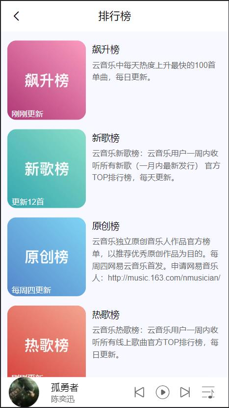
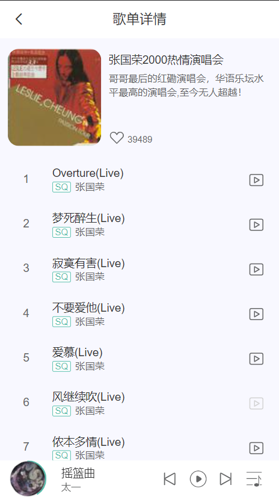
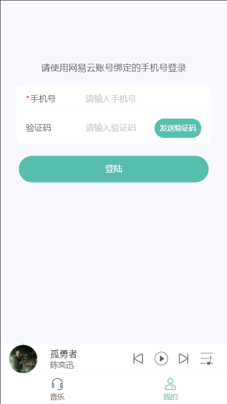

## xz-music 音乐播放器（web移动端）

## 免责声明
本站使用了开源的[网易云音乐 NodeJS 版 API](https://github.com/Binaryify/NeteaseCloudMusicApi)，
本站不存储任何音频、视频资源，仅为学习使用，请遵守版权要求！！！

## API接口安装及运行
请参考文档，[网易云音乐 NodeJS 版 API 文档](https://neteasecloudmusicapi-docs.4everland.app)

## xz-music安装及运行

```bash
# 安装依赖项
$ npm install

# 开发环境运行
$ npm run dev

# 生产环境打包
$ npm run build
```

## 默认配置
- base: './',
- 开发环境下，VITE_APP_BASE_API: '/xz-music-dev-api' , 代理到 'http://localhost:3000'
- 生产环境下，VITE_APP_BASE_API: '/xz-music-prod-api'

## 技术栈

- vue全家桶 vite + vue3 + vue-router4  +pinia2
- ui库 vant
- css预处理 less
- ajax请求 axios
- 滚动优化 better-scroll

## 功能

- 音乐播放
- 歌词滚动
- 播放列表
- 播放进度（上一首、下一首、暂停、进度条）
- 音乐MV
- 音乐评论
- 喜欢音乐
- 排行榜
- 分类
- 歌单详情
- 每日推荐
- 热门MV
- 搜索（单曲、歌单、歌手、MV）
- 热门歌手
- 推荐歌单
- 推荐新音乐
- 手机号登录
- 我的喜欢
- 创建歌单
- 收藏歌单

## 页面展示
 
 
 
 
 
 
 
 
 
 
 
 
