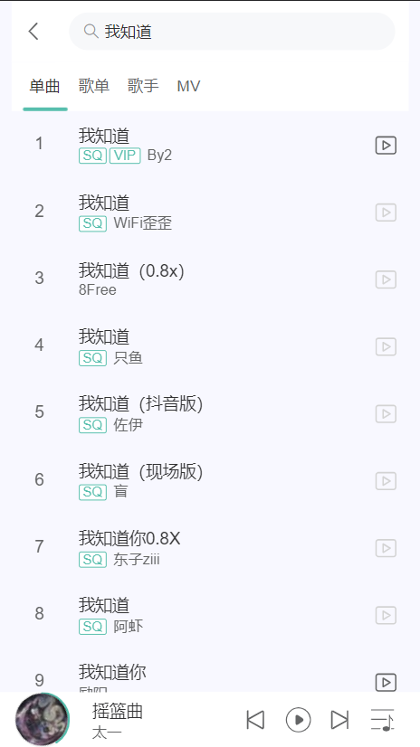

## xz-music 音乐播放器（web移动端）

## 免责声明
本站使用了开源的[网易云音乐 NodeJS 版 API](https://github.com/Binaryify/NeteaseCloudMusicApi)，
本站不存储任何音频、视频资源，仅为学习使用，请遵守版权要求！！！

## API接口安装及运行
请参考文档，[网易云音乐 NodeJS 版 API 文档](https://neteasecloudmusicapi-docs.4everland.app)

## xz-music安装及运行

```bash
# 安装依赖项
$ npm install

# 开发环境运行
$ npm run dev

# 生产环境打包
$ npm run build
```

- 开发环境下，axios 的 baseURL 为：http://localhost:3000
- 生产环境下，axios 的 baseURL 为：/xz-music-api

## 技术栈

- vue全家桶 vite + vue3 + vue-router4  +pinia2
- ui库 vant
- css预处理 less
- ajax请求 axios
- 滚动优化 better-scroll

## 功能

- 音乐播放
- 歌词滚动
- 排行榜
- 分类
- 歌单详情
- 每日推荐
- 搜索
- 热门歌手
- 推荐歌单
- 推荐新音乐
- 游客登录

## 页面展示
 
 
 
 
 
 
 
 
 
